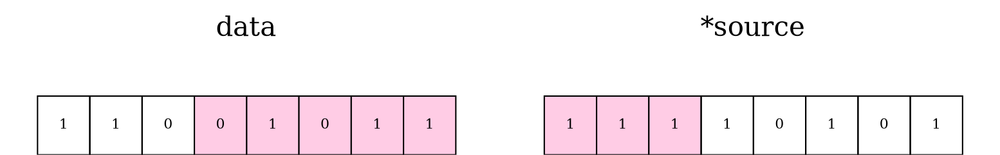
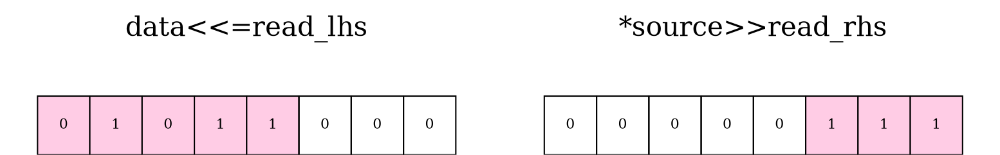
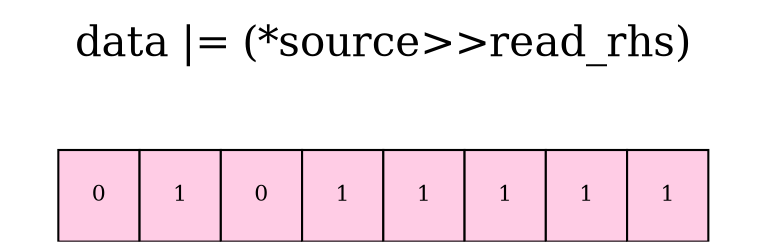
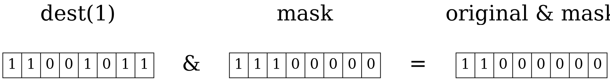
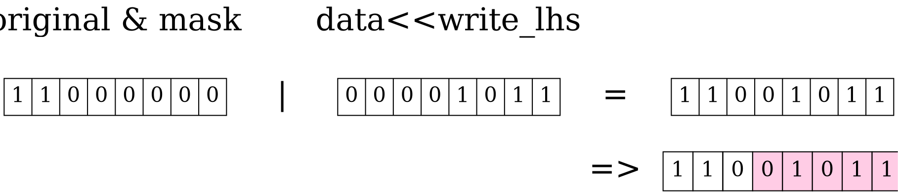
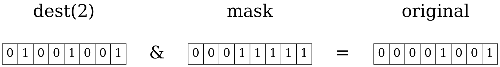
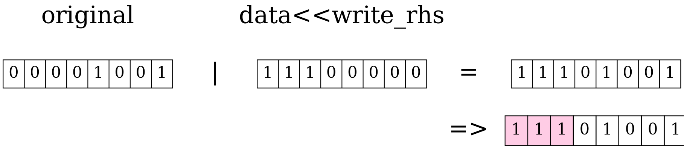

# Linux2021 Homework2(bitcpy)

contributed by < `Jings1017` >

###### tags: `linux2021`


### 1. 解釋程式碼運作原理

```c=
#include <stdint.h>

void bitcpy(void *_dest,      /* Address of the buffer to write to */
            size_t _write,    /* Bit offset to start writing to */
            const void *_src, /* Address of the buffer to read from */
            size_t _read,     /* Bit offset to start reading from */
            size_t count)
{
    size_t read_lhs = _read & 7;
    size_t read_rhs = 8 - read_lhs;
    const uint8_t *source = (const uint8_t *) _src + (_read / 8);
    size_t write_lhs = _write & 7;
    size_t write_rhs = 8 - write_lhs;
    uint8_t *dest = (uint8_t *) _dest + (_write / 8);

    static const uint8_t read_mask[] = {
        0x00, /*    == 0    00000000b   */
        0x80, /*    == 1    10000000b   */
        0xC0, /*    == 2    11000000b   */
        0xE0, /*    == 3    11100000b   */
        0xF0, /*    == 4    11110000b   */
        0xF8, /*    == 5    11111000b   */
        0xFC, /*    == 6    11111100b   */
        0xFE, /*    == 7    11111110b   */
        0xFF  /*    == 8    11111111b   */
    };

    static const uint8_t write_mask[] = {
        0xFF, /*    == 0    11111111b   */
        0x7F, /*    == 1    01111111b   */
        0x3F, /*    == 2    00111111b   */
        0x1F, /*    == 3    00011111b   */
        0x0F, /*    == 4    00001111b   */
        0x07, /*    == 5    00000111b   */
        0x03, /*    == 6    00000011b   */
        0x01, /*    == 7    00000001b   */
        0x00  /*    == 8    00000000b   */
    };

    while (count > 0) {
        uint8_t data = *source++;
        size_t bitsize = (count > 8) ? 8 : count;
        if (read_lhs > 0) {
            data <<= read_lhs;
            if (bitsize > read_rhs)
                data |= (*source >> read_rhs);
        }

        if (bitsize < 8)
            data &= read_mask[bitsize];

        uint8_t original = *dest;
        uint8_t mask = read_mask[write_lhs];
        if (bitsize > write_rhs) {
            /* Cross multiple bytes */
            *dest++ = (original & mask) | (data >> write_lhs);
            original = *dest & write_mask[bitsize - write_rhs];
            *dest = original | (data << write_rhs);
        } else {
            // Since write_lhs + bitsize is never >= 8, no out-of-bound access.
            mask |= write_mask[bitsize - write_lhs];
            *dest++ = (original & mask) | (data >> write_lhs);
        }

        count -= bitsize;
    }
}
```

先從參數看起 : 

* `_dest` : 表示欲貼上的起始位址
* `_write` : _dest 之偏移量
* `_src` : 表示欲複製的起始位址
* `_read` : _src 的偏移量
* `_count` : 表示欲複製的位元數 


:::info
在程式中，策略是從 `_src` 中一次搬動一個 byte 到 `_dest` 中，若 bit offset 非 8 的倍數時，則需要做處理。
處理方式又分為讀和寫，讀的時候使用 `read_lhs` 及 `read_rhs`，寫的時候則使用  `write_lhs` 及 `write_rhs`。
以讀為例，`read_lhs` 表示左半不需讀取的 bit 數，而 `read_rhs` 表示右半不需讀取的 bit 數，寫的部分同理故省略之。
:::

#### bitcopy 實作

```
...
data = *source++;
    bitsize = (_count > 8) ? 8 : _count;
    if (read_lhs > 0) {
        data <<= read_lhs;
        if (bitsize > read_rhs)
            data |= (*source >> read_rhs);
    }
...
```

進入 while 迴圈時，先把 8-bit 的資料複製到 `data` 中，然後分兩種情形

* `read_lhs` 位移為 0 : 直接把 `source` 的 8 bit 給 data
* `read_lhs` 位移非 0 : 非從 `source` 第一個 bit 開始複製，以下圖表示
 
假設 `_read_lhs` 為 3，即從第三個位元開始複製，則 `read_lhs = 3; read_rhs = 5`。而目前 `data` 是從 `source` 第 0 位元開始，所以必須把 `data` 往左移動 3 格，如圖左下方所示。而下一個 `source` (因為先前已做了 `data=*source++` ) 則往右移動 5 格，如圖右下方所示。最後再將處理好的左右兩部分做 `|` 運算，即可得到我們要的前 8 bit 。








```
...
if (bitsize < 8)
    data &= read_mask[bitsize];
...
```

如果目前還需再讀取的 bit 數小於 8 時，這時候就要透過 mask 來將多餘的部分設成 0


再來是處理寫到 `dest` 的部分

```
uint8_t original = *dest;
uint8_t mask = read_mask[write_lhs];
if (bitsize > write_rhs) {
    ...
} else {
    ...
}
```

目前的 `data` 為經過讀取時處理後的資料，在此直接給 `dest`。
而 `mask` 則用來保留左邊 bit 和清除右邊 bit ，因為若有位移的話，不能影響到左邊 bit 

在此舉一實例做為參考:

假設 `_write = 3` ，則得到 `write_lhs = 3; write_rhs = 5`。
如果該次需要寫入的位元超過 `write_lhs` ( 即 `bitsize > write_rhs` )， 代表接下來要貼上的 8 位元有跨單位 ，故需要做以下處理。

```
/* Cross multiple bytes */
*dest++ = (original & mask) | (data >> write_lhs);
original = *dest & write_mask[bitsize - write_rhs];
*dest = original | (data << write_rhs);
```

分述如下:

* 將前 5 bit 寫入 `dest` 中，其中不能汙染到前 3 bit，且需將 `dest` 往下移動一格
* 把下一格 `dest` 的右邊 5 個 bit 保留好存到 `original` ( 其中左邊 3 個清成 0 )
* 把 `original` 往左移 5 bit，所以目前的前三 bit 就是上次 data 還沒複製到 dest 的資料。透過 | 把第二步驟留下的左三 bit 填滿

示意圖如下 : 

粉紅色為貼上 data 的部分

```graphviz
digraph {
    graph [rankdir = TB]
    node [shape=plaintext, fontsize=40];
    "" -> "before" -> "data" ->"after" ->"lhs/rhs"[fontcolor=black, color=white];
    node [shape=none, fontcolor=black, fontsize=25, width=4.75, fixedsize=true];

    byte0 [
        shape=none
        label=<<table border="0" cellborder="1" cellspacing="0" cellpadding="17">
                <tr>
                <td port="port0">1</td>
                <td port="port1">1</td>
                <td port="port2">0</td>
                <td port="port3">0</td>
                <td port="port4">1</td>
                <td port="port5">0</td>
                <td port="port6">1</td>
                <td port="port7">1</td>
                </tr>
        </table>>
    ];
    byte1 [
        shape=none
        label=<<table border="0" cellborder="1" cellspacing="0" cellpadding="17">
                <tr>
                <td port="port0">0</td>
                <td port="port1">1</td>
                <td port="port2">0</td>
                <td port="port3">0</td>
                <td port="port4">1</td>
                <td port="port5">0</td>
                <td port="port6">0</td>
                <td port="port7">1</td>
                </tr>
        </table>>
    ];
    
    
    byte3 [
        shape=none
        label=<<table border="0" cellborder="1" cellspacing="0" cellpadding="17">
                <tr>
                <td port="port0">1</td>
                <td port="port1">1</td>
                <td port="port2">0</td>
                <td port="port3" bgcolor="#ffcce5">0</td>
                <td port="port4" bgcolor="#ffcce5">1</td>
                <td port="port5" bgcolor="#ffcce5">0</td>
                <td port="port6" bgcolor="#ffcce5">1</td>
                <td port="port7" bgcolor="#ffcce5">1</td>
                </tr>
        </table>>
    ];
    byte4 [
        shape=none
        label=<<table border="0" cellborder="1" cellspacing="0" cellpadding="17">
                <tr>
                <td port="port0" bgcolor="#ffcce5">1</td>
                <td port="port1" bgcolor="#ffcce5">1</td>
                <td port="port2" bgcolor="#ffcce5">1</td>
                <td port="port3">0</td>
                <td port="port4">1</td>
                <td port="port5">0</td>
                <td port="port6">0</td>
                <td port="port7">1</td>
                </tr>
        </table>>
    ];
    

    t0 [
        shape=none
        label=<<table border="0" cellborder="1" cellspacing="0" cellpadding="17">
                <tr>
                
                <td port="port3" bgcolor="#ffcce5">0</td>
                <td port="port4" bgcolor="#ffcce5">1</td>
                <td port="port5" bgcolor="#ffcce5">0</td>
                <td port="port6" bgcolor="#ffcce5">1</td>
                <td port="port7" bgcolor="#ffcce5">1</td>
                </tr>
        </table>>
    ];
    t1 [
        shape=none
        label=<<table border="0" cellborder="1" cellspacing="0" cellpadding="17">
                <tr>
                <td port="port0" bgcolor="#ffcce5">1</td>
                <td port="port1" bgcolor="#ffcce5">1</td>
                <td port="port2" bgcolor="#ffcce5">1</td>

                </tr>
        </table>>
    ];
    
    bitsize [shape=record label="bitsize", color="white", fontcolor="black",fontsize=35];
    
    "bitsize" -> byte0:port3 [color=black];
    "bitsize" -> byte1:port2 [color=black];
    
    t0:port3 -> byte0:port3 [color=none];
    t1:port0 -> byte1:port0 [color=none];
 
    
    byte3:port3 -> t0:port3 [color=none];
    byte4:port0 -> t1:port0 [color=none];
    
     write_lhs [shape=record label="write_lhs", color="white", fontcolor="black",fontsize=30];
    "write_lhs" -> byte3:port3 [color=black arrowhead=none];
    
    dest1 [shape=record label="dest(1)", color="white", fontcolor="black",fontsize=30];
    "dest1" -> byte0:port0 [color=none];
    
    dest2 [shape=record label="dest(2)", color="white", fontcolor="black",fontsize=30];
    "dest2" -> byte1:port4 [color=none];
    
    

     { rank=same; "before"; byte0; byte1 }
     { rank=same; "data"; t0; t1; }
     { rank=same; "lhs/rhs";  write_lhs;}
     { rank=same; "after"; byte3; byte4; }
}
```




上圖之詳細過程如下 : 

* 左半





* 右半






而第二種情況則不需考慮跨單位的處理

```
*dest++ = (original & mask) | (data >> write_lhs);
```

`(original & mask)` 讓左邊保持原本的狀態，右邊清成 0，接著透過 | 把右邊清掉的位元填上 `data`。

```
count -= bitsize;
```

最後再更新還需寫多少 bit 即可。

        
### 2. 說明其改進空間

由於過多的 branch miss 會造成整體效率下降，所以可以減少程式中不必要的 if 條件式之使用，便可減少分支的產生，以利提升程式效能。

這段 `bitcpy` 讀取的過程中，因為最後都能夠用 `read_mask` 將 `data` 中不需要的部分剔除，因此在這之前其實不需要再去調整 data 要讀取的 range 有多大、以及有沒有跨越到下一個 byte，直接將完整一個 byte 的大小讀取出來，最後再用 `read_mask` 留下需要的部分即可，因此程式可以改成如下，將所有 if 條件式移除：

```diff=
        size_t bitsize = (count > 8) ? 8 : count;
-       if (read_lhs > 0) {
            data <<= read_lhs;
-           if (bitsize > read_rhs)
                data |= (*source >> read_rhs);
-       }

-       if (bitsize < 8)
            data &= read_mask[bitsize];
...            
```

此外，程式中另外宣告的兩個 `mask`，在使用時需要來回查看其內容，使用上有些許不便，額外宣告這兩個陣列也會增加記憶體 stack 空間的使用，應該有更好的實作方式，我觀察後發現兩陣列的內容有規律性，其實透過 bitwise 的操作就可以直接完成了，取代方式如下：

```c
read_mask[i] == 0xFF << (8 - i)
write_mask[i] == 0xFF >> i
```

又在 `/ 8` 的部份可以換成 `>> 3`，以提升運算速度

```diff=
    size_t read_lhs = _read & 7;
    size_t read_rhs = 8 - read_lhs;
-    const uint8_t *source = (const uint8_t *) _src + (_read / 8);
+    const uint8_t *source = (const uint8_t *) _src + (_read >> 3);
    size_t write_lhs = _write & 7;
    size_t write_rhs = 8 - write_lhs;
-    uint8_t *dest = (uint8_t *) _dest + (_write / 8);
+    uint8_t *dest = (uint8_t *) _dest + (_write >> 3);
```

再來，可以減少變數的宣告， `orginal` 其實可以直接用 `*dest` 取代，並不影響結果。
```diff=
-       uint8_t original = *dest;
        uint8_t mask = read_mask[write_lhs];
        if (bitsize > write_rhs) {
            /* Cross multiple bytes */
-            *dest++ = (original & mask) | (data >> write_lhs);
+            *dest++ = (*dest & mask) | (data >> write_lhs);
-            original = *dest & write_mask[bitsize - write_rhs];
+            *dest = *dest & write_mask[bitsize - write_rhs];
-            *dest = original | (data << write_rhs);
+            *dest = *dest | (data << write_rhs);
        } else {
            // Since write_lhs + bitsize is never >= 8, no out-of-bound access.
            mask |= write_mask[bitsize - write_lhs];
-            *dest++ = (original & mask) | (data >> write_lhs);
+            *dest++ = (*dest & mask) | (data >> write_lhs);
        }
```


為了提升運算效能，可以將 if 換成 bitwise ，避免不必要的 branch miss
因此將 `bitsize = (count > 8) ? 8 : count` 換成 bitwise 運算
想法是利用 `min(a,b)` 之 bitwise 運算，其中 `b` 帶入 `8`
即 `min(a,8)` ，符合預期結果
並參考 [先前一對一討論筆記](https://hackmd.io/CEe0nVwSQgOwHg5rVt32HQ) 分析出 min(a,b)

:::info
已知 `A xor B xor A = B` 
並考慮 `a-b` 是否為正，
針對 `a-b` 最左 bit 進行判斷，若為 `1` 即表示 `a<b`，否則表示 `a>b`
寫成程式碼可表示成可用 `(a-b)&(1<<31)`
再將此結果右移 31 位到最右 bit，即 `(((a-b) & (1<<31))>>63)`
此時 結果為 `1` or `0`
加上負號以二補數表示即 `111..111` or `000...000`
再與 `(a^b)` 做 `&` 運算，
其結果為 `(a^b)&(111...111) = (a^b)` or `(a^b)&(000...000) = 0`
最後再與 `b` 做 `^` 運算，可得 `b^(a^b) = a` or `b^0=b`，
因此可判斷出 `min(a,b)`

*  相對應的表格如下

| operation | a < b | a > b |
| -------- | -------- | -------- |
| a-b     | 1xx..xxx     | 0xx..xxx     |
| (a-b)&(1<<31)     | 100..000     | 000...000 |
| ((a-b) & (1<<31)) >>63    | 000..001 | 000..000 |
| -(((a-b) & (1<<31))>>63)  | 111..111  | 000..000 |
| (a ^ b) & -(((a-b) & (1<<31))>>63) | a^b | 000..000|
| b ^ ((a ^ b) & -(((a-b) & (1<<31))>>63)|a|b|

:::


可得以下結果

```diff=
- size_t bitsize = (count > 8) ? 8 : count;
+ size_t bitsize = 8^((count^8)&(-(((count-8)&(1<<31))>>63)));
```

將上述整理之後，`my_bitcpy` 程式碼如下
> [GitHub](https://github.com/Jings1017/Linux_Kernel_2021/blob/master/quiz2/question3/bitcpy.c)

```c=
void my_bitcpy(void *_dest,      /* Address of the buffer to write to */
            size_t _write,    /* Bit offset to start writing to */
            const void *_src, /* Address of the buffer to read from */
            size_t _read,     /* Bit offset to start reading from */
            size_t count)
{
    size_t read_lhs = _read & 7;
    size_t read_rhs = 8 - read_lhs;
    const uint8_t *source = (const uint8_t *) _src + (_read >> 3);
    size_t write_lhs = _write & 7;
    size_t write_rhs = 8 - write_lhs;
    uint8_t *dest = (uint8_t *) _dest + (_write >> 3);

    while (count > 0) {
        uint8_t data = *source++;
        size_t bitsize = 8^((count^8)&(-(((count-8)&(1<<31))>>63)));
        
        data <<= read_lhs;
        data |= (*source >> read_rhs);
        data &= 0xFF << (8-bitsize);

        uint8_t mask = 0xFF << (8 - write_lhs);
        if (bitsize > write_rhs) {
            /* Cross multiple bytes */
            *dest++ = (*dest & mask) | (data >> write_lhs);
            *dest = *dest & (0xFF >> (bitsize - write_rhs));
            *dest = *dest | (data << write_rhs);
        } else {
            // Since write_lhs + bitsize is never >= 8, no out-of-bound access.
            mask |= (0xFF >>(write_lhs + bitsize));
            *dest++ = (*dest & mask) | (data >> write_lhs);
        }

        count -= bitsize;
    }
}
```

`main` 程式碼如下

```c=
int main()
{
    struct timespec t1,t2;
    FILE *fp = fopen("comp_data","w");
    for (int size = 8; size < 8000; size++) {
        memset(&output[0], 0x00, sizeof(output));
        clock_gettime(CLOCK_REALTIME, &t1);
        bitcpy(&output[0], 2, &input[0], 4, size);
        clock_gettime(CLOCK_REALTIME, &t2);
        printf( "%lu\n", t2.tv_nsec - t1.tv_nsec);
        fprintf(fp, "%d\t", size);
        fprintf(fp, "%lu\t", t2.tv_nsec - t1.tv_nsec);
        
        
        memset(&output[0], 0x00, sizeof(output));
        clock_gettime(CLOCK_REALTIME, &t1);
        my_bitcpy(&output[0], 2, &input[0], 4, size);
        clock_gettime(CLOCK_REALTIME, &t2);
        printf( "%lu\n", t2.tv_nsec - t1.tv_nsec);
        fprintf(fp, "%lu\n", t2.tv_nsec - t1.tv_nsec);
    }
    fclose(fp);
    return 0;
}
```

使用 `perf` 測量分支數量，參考自 [Linux 效能分析工具: Perf](http://wiki.csie.ncku.edu.tw/embedded/perf-tutorial)

```
$ sudo perf record \
-e branch-misses:u,branch-instructions:u \
-F 10000 ./bitcopy
$ sudo perf report 
```

原始版本的測量結果如下

```
Available samples
579 branch-misses:u
804 branch-instructions:u
```

改寫後的版本測量如下

```
Available samples
567 branch-misses:u
722 branch-instructions:u
```


可從結果看出明顯減少許多分支指令

再使用 `perf` 測量 cache miss 等資訊

```
sudo perf stat --repeat 5 \
    -e cache-misses,cache-references,\
    instructions,cycles ./bitcopy
```

原先的版本
```
  Performance counter stats for './bitcopy' (5 runs):

           22,6139      cache-misses              #    9.919 % of all cache refs      ( +-  1.45% )
          227,9821      cache-references                                              ( +-  6.52% )
       3,5577,6191      instructions              #    1.95  insn per cycle           ( +-  0.02% )
       1,8256,0205      cycles                                                        ( +-  1.16% )

           0.20857 +- 0.00647 seconds time elapsed  ( +-  3.10% )
```

改良後的版本

```
 Performance counter stats for './bitcopy' (5 runs):

           21,3110      cache-misses              #    9.851 % of all cache refs      ( +-  2.93% )
          216,3288      cache-references                                              ( +-  3.54% )
       3,5625,8057      instructions              #    2.06  insn per cycle           ( +-  0.01% )
       1,7311,7516      cycles                                                        ( +-  0.82% )

           0.20262 +- 0.00395 seconds time elapsed  ( +-  1.95% )
```

但是在使用 gnuplot 製圖後，發現改良後的版本其實在時間成本上並沒有實質的改善，如下圖所示


所以再將程式碼以另一種方式做改寫

而想法主要是降低 branch 判斷次數外，一開始先處理最前方小於 8 bit 的資料( line 19 - 22 )，再利用迴圈的方式來處理每次 8 bit 的資料( line 24-26 )，最後再處理最後方小於 8 bit 的資料( line 28-30 )。

程式碼片段如下 : 

```c=
void my_bitcpy(void *_dest,      /* Address of the buffer to write to */
            size_t _write,    /* Bit offset to start writing to */
            const void *_src, /* Address of the buffer to read from */
            size_t _read,     /* Bit offset to start reading from */
            size_t count)
{
    const uint8_t MASK[8] = { 1, 3, 7, 15, 31, 63, 127, 255 };
    uint8_t *src = (uint8_t *)_src + (_read >> 3);
    uint8_t src_off = _read & 7;
    uint8_t *dest = (uint8_t *)_dest + (_write >> 3);
    uint8_t dest_off = _write & 7;
    size_t offset = src_off - dest_off;
    
    count -= (8 - dest_off);
    
    int timer = count >> 3;
    int append = (count & 7);

    uint8_t data  = (*src++ << offset) ;
    data |= ((*src >> (8 - offset)) & MASK[offset - 1]);
    data &= MASK[7 - dest_off];
    *dest++ |= data;
    
    while (timer-- > 0){
        *dest++ = (*src++ << offset) | ((*src >> (8 - offset)) & MASK[offset - 1]);
    }

    if (append >= 0) {
        *dest |= ((*src++ << offset) | (*src >> (8 - offset))) & (~MASK[7 - append]);
    }
}
```

但由於此法是以跨位址為考量點而設計的，所以在小範圍的複製上，效能提升有限。

再使用 `perf` 測量分支數量

```
Available samples
504 branch-misses:u
715 branch-instructions:u
```
使用 `perf` 測量 cache miss 等資訊

```
 Performance counter stats for './bitcopy' (5 runs):

           13,6170      cache-misses              #    6.555 % of all cache refs      ( +-  1.69% )
          207,7363      cache-references                                              ( +-  9.49% )
       3,5490,3783      instructions              #    2.05  insn per cycle           ( +-  0.02% )
       1,7318,3229      cycles                                                        ( +-  2.63% )

           0.16458 +- 0.00911 seconds time elapsed  ( +-  5.53% )
```

再做一次 gnuplot ，可以發現在總體 bit 愈大時，在速度上的差異也愈大


將三種不同的 bitcpy function 一起做比較，如下圖


### 3. 參考

- [ ] [lib/bitmap.c](https://git.kernel.org/pub/scm/linux/kernel/git/torvalds/linux.git/tree/lib/bitmap.c?h=v5.12-rc2#n292)
```cpp=292
void __bitmap_replace(unsigned long *dst,
		      const unsigned long *old, const unsigned long *new,
		      const unsigned long *mask, unsigned int nbits)
{
	unsigned int k;
	unsigned int nr = BITS_TO_LONGS(nbits);

	for (k = 0; k < nr; k++)
		dst[k] = (old[k] & ~mask[k]) | (new[k] & mask[k]);
}
EXPORT_SYMBOL(__bitmap_replace);
```

- [ ] [drivers/video/fbdev/amifb.c](https://git.kernel.org/pub/scm/linux/kernel/git/torvalds/linux.git/tree/drivers/video/fbdev/amifb.c?h=v5.12-rc2#n2602)
```cpp=2597

	/*
	 *  Unaligned forward bit copy using 32-bit or 64-bit memory accesses
	 */

static void bitcpy(unsigned long *dst, int dst_idx, const unsigned long *src,
		   int src_idx, u32 n)
           ...
```

- [ ] [linux/include/linux/bitmap.h](https://elixir.bootlin.com/linux/latest/source/include/linux/bitmap.h#L245) 中的 `bitmap_copy` 及 `bitmap_copy_clear_tail`

採逐 bit 進行資料複製，但此兩函式皆不會保留 byte 內沒有複製到的 bit。 

```c=245
static inline void bitmap_copy(unsigned long *dst, const unsigned long *src,
    unsigned int nbits)
{
    unsigned int len = BITS_TO_LONGS(nbits) * sizeof(unsigned long);
    memcpy(dst, src, len);
}

/*
 * Copy bitmap and clear tail bits in last word.
 */
static inline void bitmap_copy_clear_tail(unsigned long *dst,
    const unsigned long *src, unsigned int nbits)
{
    bitmap_copy(dst, src, nbits);
    if (nbits % BITS_PER_LONG)
        dst[nbits / BITS_PER_LONG] &= BITMAP_LAST_WORD_MASK(nbits);
}
```


#### 圖形處理的 Framebuffer
引述自 [Stéphane Marchesin - Linux Graphics Drivers: an Introduction](https://people.freedesktop.org/~marcheu/linuxgraphicsdrivers.pdf) ：
> 
> **4.2 Framebuffer operations**
> The framebuffer operations structure is how non-modesetting framebuffer callbacksare set. Different callbacks can be set depending on what functionality you wish to implement, like fills, copies, or cursor handling. By filling struct fb_ops callbacks, one can implement the following functions:
> 
> Copy data from area to another
> ```cpp
> void fb_copyarea(struct fb_info ∗info, const struct fb_copyarea ∗region)
> ```

而 `fb_copyarea` 是被包在 `fb_ops` 結構中，在 [drivers/video/fbdev/amifb.c](https://git.kernel.org/pub/scm/linux/kernel/git/torvalds/linux.git/tree/drivers/video/fbdev/amifb.c?h=v5.12-rc2#n3500) 初始為以下：
```cpp=3500
static const struct fb_ops amifb_ops = {
	.owner		= THIS_MODULE,
	.fb_check_var	= amifb_check_var,
	.fb_set_par	= amifb_set_par,
	.fb_setcolreg	= amifb_setcolreg,
	.fb_blank	= amifb_blank,
	.fb_pan_display = amifb_pan_display,
	.fb_fillrect	= amifb_fillrect,
	.fb_copyarea	= amifb_copyarea,
	.fb_imageblit	= amifb_imageblit,
	.fb_ioctl	= amifb_ioctl,
};
```
`amifb_copyarea` 則一樣在 [drivers/video/fbdev/amifb.c](https://git.kernel.org/pub/scm/linux/kernel/git/torvalds/linux.git/tree/drivers/video/fbdev/amifb.c?h=v5.12-rc2#n3246) 中：
```cpp=3246
static void amifb_copyarea(struct fb_info *info,
			   const struct fb_copyarea *area)
    ...
	if (rev_copy) {
		while (height--) {
			dst_idx -= par->next_line * 8;
			src_idx -= par->next_line * 8;
			copy_one_line_rev(info->var.bits_per_pixel,
					  par->next_plane, dst, dst_idx, src,
					  src_idx, width);
		}
	} else {
		while (height--) {
			copy_one_line(info->var.bits_per_pixel,
				      par->next_plane, dst, dst_idx, src,
				      src_idx, width);
			dst_idx += par->next_line * 8;
			src_idx += par->next_line * 8;
		}
	}
}
```
其中 [`copy_one_line`](https://git.kernel.org/pub/scm/linux/kernel/git/torvalds/linux.git/tree/drivers/video/fbdev/amifb.c?h=v5.12-rc2#n3211) 使用到 `bitcpy` ：
```cpp=3211
static inline void copy_one_line(int bpp, unsigned long next_plane,
				 unsigned long *dst, int dst_idx,
				 unsigned long *src, int src_idx, u32 n)
{
	while (1) {
		dst += dst_idx >> SHIFT_PER_LONG;
		dst_idx &= (BITS_PER_LONG - 1);
		src += src_idx >> SHIFT_PER_LONG;
		src_idx &= (BITS_PER_LONG - 1);
		bitcpy(dst, dst_idx, src, src_idx, n);
		if (!--bpp)
			break;
		dst_idx += next_plane * 8;
		src_idx += next_plane * 8;
	}
}
```


#### user and kernel space
是以 byte 單位。
引自 [Oracle® Linux 6Porting Guide](https://docs.oracle.com/en/operating-systems/oracle-linux/6/porting/section_ohm_jhk_tm.html)
> You can use the `copy_from_user()` and `copy_to_user()` functions to move data between kernel space and user space. Alternatively, **when moving one, two, four, or eight bytes of data**, you can use either `put_user()` and `get_user()` or `access_ok()` to validate the user-space address followed by either `__put_user()` or` __get_user()`.
>
> If user programs require direct access to device memory, you can use the mmap() system call, which maps device memory directly into user space. For example, the X server uses mmap() to write to video adapter memory and PCI devices usually memory map their control registers to improve performance. A limitation is that the area being mapped has to be a multiple of PAGE_SIZE and start at a physical memory address that is also a multiple of PAGE_SIZE.

#### 額外
查閱資料時看到此函式，覺得有趣也上放來。
在 [linux-kernel-labs.github.io](https://linux-kernel-labs.github.io/refs/heads/master/labs/memory_mapping.html) 的 memory mapping 有看到
> Enable the PG_reserved bit of each page with SetPageReserved(). Clear the bit with ClearPageReserved() before freeing the memory.

其中 `SetPageReserved()` 為 `#define SetPageReserved(page)	set_bit(PG_reserved, &(page)->flags)` 。

而此作用在 [linux-kernel-labs.github.io - memory mapping](https://linux-kernel-labs.github.io/refs/heads/master/labs/memory_mapping.html) 是
> Since the pages are mapped to user space, they might be swapped out. To avoid this we must set the PG_reserved bit on the page. Enabling is done using SetPageReserved() while reseting it (which must be done before freeing the memory) is done with ClearPageReserved():

因此去查了原始碼竟然是用 **inline assembly** 實作，是為了確保是 **atomic** 層級的操作

- [ ] [`arch/alpha/include/asm/bitops.h`](https://git.kernel.org/pub/scm/linux/kernel/git/torvalds/linux.git/tree/arch/alpha/include/asm/bitops.h?h=v5.12-rc2#n28)
```cpp
/*
 * These have to be done with inline assembly: that way the bit-setting
 * is guaranteed to be atomic. All bit operations return 0 if the bit
 * was cleared before the operation and != 0 if it was not.
 *
 * To get proper branch prediction for the main line, we must branch
 * forward to code at the end of this object's .text section, then
 * branch back to restart the operation.
 *
 * bit 0 is the LSB of addr; bit 64 is the LSB of (addr+1).
 */

static inline void
set_bit(unsigned long nr, volatile void * addr)
{
	unsigned long temp;
	int *m = ((int *) addr) + (nr >> 5);

	__asm__ __volatile__(
	"1:	ldl_l %0,%3\n"
	"	bis %0,%2,%0\n"
	"	stl_c %0,%1\n"
	"	beq %0,2f\n"
	".subsection 2\n"
	"2:	br 1b\n"
	".previous"
	:"=&r" (temp), "=m" (*m)
	:"Ir" (1UL << (nr & 31)), "m" (*m));
}
```
 
:::info
Reference
* [wikipedia - Bit array](https://en.wikipedia.org/wiki/Bit_array)
* Linux kernel source tree
    * [root/lib/bitmap.c](https://git.kernel.org/pub/scm/linux/kernel/git/torvalds/linux.git/tree/lib/bitmap.c?h=v5.12-rc2)
    * [root/drivers/video/fbdev/amifb.c](https://git.kernel.org/pub/scm/linux/kernel/git/torvalds/linux.git/tree/drivers/video/fbdev/amifb.c?h=v5.12-rc2)
* [Stéphane Marchesin - Linux Graphics Drivers: an Introduction](https://people.freedesktop.org/~marcheu/linuxgraphicsdrivers.pdf)
* [Oracle® Linux 6Porting Guide](https://docs.oracle.com/en/operating-systems/oracle-linux/6/porting/section_ohm_jhk_tm.html)
* [developer.ibm.com - User space memory access from the Linux kernel](https://developer.ibm.com/technologies/linux/articles/l-kernel-memory-access/)
* [linux-kernel-labs.github.io - memory mapping](https://linux-kernel-labs.github.io/refs/heads/master/labs/memory_mapping.html)
* [blog.csdn.net - Linux驱动开发杂记(0x0C) - SetPageReserved()](https://blog.csdn.net/u011471873/article/details/84105133)
:::


#### [93i7xo2 同學](https://hackmd.io/@93i7xo2) 改良 bitcpy 之實作

使用 `perf -F max` 以最大取樣頻率分析函式內部熱點，而為了採樣更多的數據分析，放大原本的`input, output, i, j, k` 為32倍，此時 `perf.data` 來到100M。Intel 和 AT&T 語法尚有[些微差異](http://web.mit.edu/rhel-doc/3/rhel-as-en-3/i386-syntax.html)，`perf report` 時使用 `-M intel` 更好閱讀。
```bash
sudo perf record -F max ./main
sudo perf report -M intel
```
發現函式內部熱點大多集中在 `mov`，而 `mov` 的 register operand 最大可為 64bit，既然如此，實作 64-bit 的 `bitcpy` 對效能應有所改善。
```
  1.09 │       lea     rcx,[rip+0xd6e]
  1.71 │       movzx   eax,BYTE PTR [rax+rcx*1]
  0.78 │       and     eax,edx
  5.07 │       mov     BYTE PTR [rbp-0x3a],al
       │     *dest = original | (data << write_rhs);
  0.27 │       movzx   eax,BYTE PTR [rbp-0x3b]
  0.07 │       mov     rdx,QWORD PTR [rbp-0x10]
  0.00 │       mov     ecx,edx
  3.19 │       shl     eax,cl
  0.02 │       mov     edx,eax
  3.13 │       movzx   eax,BYTE PTR [rbp-0x3a]
  2.34 │       or      eax,edx
  0.07 │       mov     edx,eax
  0.00 │       mov     rax,QWORD PTR [rbp-0x30]
  6.00 │       mov     BYTE PTR [rax],dl
  0.10 │     ↓ jmp     1ca
```
以下為 64-bit 版的 `bitcpy`
```cpp=
#define __ALIGN_KERNEL(x, a) __ALIGN_KERNEL_MASK(x, (__typeof__(x))(a)-1)
#define __ALIGN_KERNEL_MASK(x, mask) (((x) + (mask)) & ~(mask))
#define ALIGN_DOWN(x, a) __ALIGN_KERNEL((x) - ((a)-1), (a))

#define reverse_byte(n)                                                             \
    __extension__({                                                                 \
        __typeof__(n + 0) _n = (n);                                                 \
        _n = ((_n & 0xffffffff00000000) >> 32) | ((_n & 0x00000000ffffffff) << 32); \
        _n = ((_n & 0xffff0000ffff0000) >> 16) | ((_n & 0x0000ffff0000ffff) << 16); \
        _n = ((_n & 0xff00ff00ff00ff00) >> 8) | ((_n & 0x00ff00ff00ff00ff) << 8);   \
    })

void bitcpy64(void *_dest,      /* Address of the buffer to write to */
              size_t _write,    /* Bit offset to start writing to */
              const void *_src, /* Address of the buffer to read from */
              size_t _read,     /* Bit offset to start reading from */
              size_t count)
{
    size_t read_lhs = _read & 63;
    size_t read_rhs = 64 - read_lhs;
    const uint64_t *source = (const uint64_t *)_src + (_read / 64);
    size_t write_lhs = _write & 63;
    size_t write_rhs = 64 - write_lhs;
    uint64_t *dest = (uint64_t *)_dest + (_write / 64);

    while (count > 0)
    {
        /* Downgrade 64-bit version to 8-bit version */
        if (count < 64)
        {
            size_t _read_lhs = ALIGN_DOWN(read_lhs, 8);
            size_t _write_lhs = ALIGN_DOWN(write_lhs, 8);
            bitcpy(((uint8_t *)dest) + _write_lhs / 8,
                   write_lhs - _write_lhs,
                   ((uint8_t *)source) + _read_lhs / 8,
                   read_lhs - _read_lhs,
                   count);
            return;
        }

        uint64_t data = reverse_byte(*source++);
        size_t bitsize = (count > 64) ? 64 : count;
        if (read_lhs > 0)
        {
            data <<= read_lhs;
            if (bitsize > read_rhs)
                data |= (reverse_byte(*source) >> read_rhs);
        }

        if (bitsize < 64)
            data &= (int64_t)(1ULL << 63) >> (bitsize - 1);

        uint64_t original = reverse_byte(*dest);
        uint64_t mask = write_lhs ? ((int64_t)(1ULL << 63) >> (write_lhs - 1)) : 0;
        if (bitsize > write_rhs)
        {
            /* Cross multiple bytes */
            *dest++ = reverse_byte((original & mask) | (data >> write_lhs));
            original = reverse_byte(*dest) & ~((int64_t)(1ULL << 63) >> (bitsize - write_rhs - 1));
            *dest = reverse_byte(original | (data << write_rhs));
        }
        else
        {
            // Since write_lhs + bitsize is never >= 64, no out-of-bound access.
            mask |= ~((int64_t)(1ULL << 63) >> (write_lhs + bitsize - 1));
            *dest++ = reverse_byte((original & mask) | (data >> write_lhs));
        }

        count -= bitsize;
    }
}
```
上面程式碼假定使用者會在呼叫函式前判斷寫入/讀取處理是否越界。

64位元版本的 `bitcpy` 與原先版本差在 buffer 從 8-bit 變化至 64-bit，這裡用 32-bit buffer 進行說明，於原先的記憶體配置下得到的資料會是：
```
            0xAA             0xBB              0xCC             0xDD
bits  7 6 5 4 3 2 1 0 | 7 6 5 4 3 2 1 0 | 7 6 5 4 3 2 1 0 | 7 6 5 4 3 2 1 0 
            Byte0           Byte1
input 0 1 2 3 4 5 6 7   8 9 ...

                                      ||
                                      \/

uint32_t data = *source++;

            0xDD             0xCC              0xBB             0xAA
      7 6 5 4 3 2 1 0 | 7 6 5 4 3 2 1 0 | 7 6 5 4 3 2 1 0 | 7 6 5 4 3 2 1 0 
bits  32 31 30 ...                                             .....  2 1 0
      H                                                                   L
```
原先 `<<, >>, |, &` 之類的操作因為 Little Endian byte ordering 的關係無法使用，因此讀取需要用 `reverse_byte` 將位元順序翻轉再進行操作，寫入時再翻轉回來，有點像是線性轉換/反轉換。

- `+0` 的[技巧](https://stackoverflow.com/questions/18063373/is-it-possible-to-un-const-typeof-in-gcc-pure-c)是為了去掉 const qualifier。
    ```cpp=7
    __typeof__(n + 0) _n = (n);  
    ```
- 一開始擔心 `&` 在一邊是 `unsigned` 另一邊是 `signed` 型態轉換上會有問題，在[規格書](http://www.open-std.org/jtc1/sc22/wg14/www/docs/n1570.pdf)看到會先做 Usual arithmetic conversions，往下找到對應解釋
    > Otherwise, if the operand that has unsigned integer type has rank greater or equal to the rank of the type of the other operand, then the operand with signed integer type is converted to the type of the operand with unsigned integer type.
    
    放心使用
    ```cpp=51
    data &= (int64_t)(1ULL << 63) >> (bitsize - 1);
    ```
:::warning
幫你補充，根據 [C99 standard](http://www.open-std.org/jtc1/sc22/wg14/www/docs/n1256.pdf) 6.5.7.5
>The result of E1 >> E2 is E1 right-shifted E2 bit positions. If E1 has an unsigned type
or if E1 has a signed type and a nonnegative value, the value of the result is the integral
part of the quotient of E1 / 2E2. If E1 has a signed type and a negative value, the
resulting value is **implementation-defined**.

因此 [gcc documentation](https://gcc.gnu.org/onlinedocs/gcc/Integers-implementation.html) 有明確定義:
>Bitwise operators act on the representation of the value including both the sign and value bits, where the sign bit is considered immediately above the highest-value value bit. **Signed ‘>>’ acts on negative numbers by sign extension.**

當然不能說你錯，但建議可以改寫避免此用法。
>[name=BakudYao]
:::
:::info
參考[ bakudr18 共筆](https://hackmd.io/@MR-9Qa9wQLWglSAUyd6UhQ/)改寫為可讀性較高的用法：
```cpp
#define READMASK(x) ((uint64_t)(~0ULL) << (64 - (x)))
#define WRITEMASK(x) (~READ_MASK(x))
```
然而 `READ_MASK(0)` 有 undefined behavior 不得已加上分支:cry:
```cpp
#define READMASK(x) (__builtin_expect(!!(x), 1) ? ((uint64_t)(~0ULL) << (64 - (x))) : 0ULL)
#define WRITEMASK(x) (~READMASK(x))
```
:::

- 當 `count<64` 使用原先版本進行複製，地址、位移需要重新計算，借用到 [kernel.h](https://elixir.bootlin.com/linux/latest/source/include/linux/kernel.h#L35) 的 `ALIGN_DOWN`
    ```cpp=28
    /* Downgrade 64-bit version to 8-bit version */
    if (count < 64)
    {
        size_t _read_lhs = ALIGN_DOWN(read_lhs, 8);
        size_t _write_lhs = ALIGN_DOWN(write_lhs, 8);
        bitcpy(((uint8_t *)dest) + _write_lhs / 8,
               write_lhs - _write_lhs,
               ((uint8_t *)source) + _read_lhs / 8,
               read_lhs - _read_lhs,
               count);
        return;
    }
    ```

觀察複製 0~4kB 的效能差距，每次測試讀取/寫入偏移量涵蓋 0~63，64-bit 版約省下一半以上的時間：

[code](https://github.com/93i7xo2/sysprog2021q1/tree/master/quiz2/bitcpy)
::: info
看起來很有機會加入減少 branch 的作法獲得不錯的效能提升！也許你可以試試，細節可參考 [bakudr18 共筆](https://hackmd.io/@MR-9Qa9wQLWglSAUyd6UhQ/SkS-Y_lX_#%E6%94%B9%E5%96%84-bitcpy-%E6%95%88%E8%83%BD)。
>[name=BakudYao]
:::
:::info
一開始有想過減少分支數量，但 Mispredicted branch 比重太低，而且編譯器 `-O3` 開下去有時效果更好，會感覺又在做白工。

```bash
gcc -g -O0 -o main main.c
sudo perf record -b ./main
sudo perf report --sort mispredict --symbols bitcpy,bitcpy64,bitcpy64_likely
```
```
Samples: 12M of event 'cycles', Event count (approx.): 12608064
Overhead  Source Symbol                                   Target Symbol                                   Branch Mispredicted
   0.01%  [.] main                                        [.] main                                        Y
   0.01%  [.] __memset_avx2_unaligned_erms                [.] __memset_avx2_unaligned_erms                Y
   0.01%  [.] bitcpy64_likely                             [.] bitcpy64_likely                             Y
   0.00%  [.] bitcpy64                                    [.] bitcpy64                                    Y
   0.00%  [.] prepare_exit_to_usermode                    [.] swapgs_restore_regs_and_return_to_usermode  N
   0.00%  [.] swapgs_restore_regs_and_return_to_usermode  [.] swapgs_restore_regs_and_return_to_usermode  N
   0.00%  [.] swapgs_restore_regs_and_return_to_usermode  [.] native_iret                                 N
   0.00%  [.] note_gp_changes                             [.] rcu_core                                    N
   0.00%  [.] native_irq_return_iret                      [.] bitcpy64_likely                             N
   0.00%  [.] native_irq_return_iret                      [.] bitcpy64                                    N
   0.00%  [.] bitcpy64                                    [.] irq_entries_start                           N
   0.00%  [.] __memset_avx2_erms                          [.] main                                        Y 
   0.00%  [.] irq_exit                                    [.] smp_apic_timer_interrupt                    Y
```

> `bitcpy64_likely` 偏好跨 8 位元組
>    ```cpp
>    uint64_t original = reverse_byte(*dest);
>    uint64_t mask = READ_MASK(write_lhs);
>    if (__builtin_expect(!!(bitsize > write_rhs), 1))
>    ```

雖然如此，還是仿照 [bakudr18/quiz2](https://github.com/bakudr18/quiz2) 實作消除 branch-prediction 的版本

```cpp=
#define READMASK(x) (__builtin_expect(!!(x), 1) ? ((uint64_t)(~0ULL) << (64 - (x))) : 0ULL)
#define WRITEMASK(x) (~READMASK(x))

void bitcpy64_branch_predict(void *_dest,      /* Address of the buffer to write to */
                             size_t _write,    /* Bit offset to start writing to */
                             const void *_src, /* Address of the buffer to read from */
                             size_t _read,     /* Bit offset to start reading from */
                             size_t count)
{
    size_t read_lhs = _read & 63;
    size_t read_rhs = 64 - read_lhs;
    const uint64_t *source = (const uint64_t *)_src + (_read / 64);
    size_t write_lhs = _write & 63;
    size_t write_rhs = 64 - write_lhs;
    uint64_t *dest = (uint64_t *)_dest + (_write / 64);

    uint64_t data, original;
    /* copy until count < 64 bits */
    for (size_t bytecount = count >> 6; bytecount > 0; bytecount--)
    {
        data = reverse_byte(*source++);
        data = data << read_lhs | (reverse_byte(*source) >> read_rhs);
        original = reverse_byte(*dest) & READMASK(write_lhs);
        *dest++ = reverse_byte(original | (data >> write_lhs));
        *dest = reverse_byte((reverse_byte(*dest) >> write_lhs) | (data << write_rhs));
    }
    count &= 63;

    /* copy the remaining count */
    data = reverse_byte(*source++);
    data = ((data << read_lhs) | (reverse_byte(*source) >> read_rhs)) & READMASK(count);
    original = (reverse_byte(*dest) & READMASK(write_lhs));
    *dest++ = reverse_byte(original | ((data & READMASK(count)) >> write_lhs));
    if (count > write_rhs)
        *dest = reverse_byte((reverse_byte(*dest) & WRITEMASK(count - write_rhs)) | (data << write_rhs));
}
```

測量 0~16 kbits 執行100次的效能
- `-O0`

- `-O3`


發現消弭分支帶來的效益不大。其實以 `-O0` 重現 [bakudr18/quiz2](https://github.com/bakudr18/quiz2) 的實驗也與原本實驗結果有落差，`branch misses` 並效能差距的主要原因。

```bash
sudo perf record -b ./bench_bitcpy
sudo perf report --sort \
  symbol_from,symbol_to,mispredict --symbols bitcpy,bitcpy_branch_predict
```
```
Samples: 15K of event 'cycles', Event count (approx.): 15808
Overhead  Source Symbol              Target Symbol              Branch Mispredicted  IPC   [IPC Coverage]
  29.07%  [.] bitcpy                 [.] bitcpy                 N                    2.06  [ 90.8%]
  19.46%  [.] bitcpy_branch_predict  [.] bitcpy_branch_predict  N                    1.02  [ 96.4%]
   0.03%  [.] bitcpy                 [.] bitcpy                 Y                    2.06  [ 90.8%] <=====
```
:::

:::success
延伸問題:
- [ ] 在 Linux 核心原始程式碼找出逐 bit 進行資料複製的程式碼，並解說相對應的情境
:::